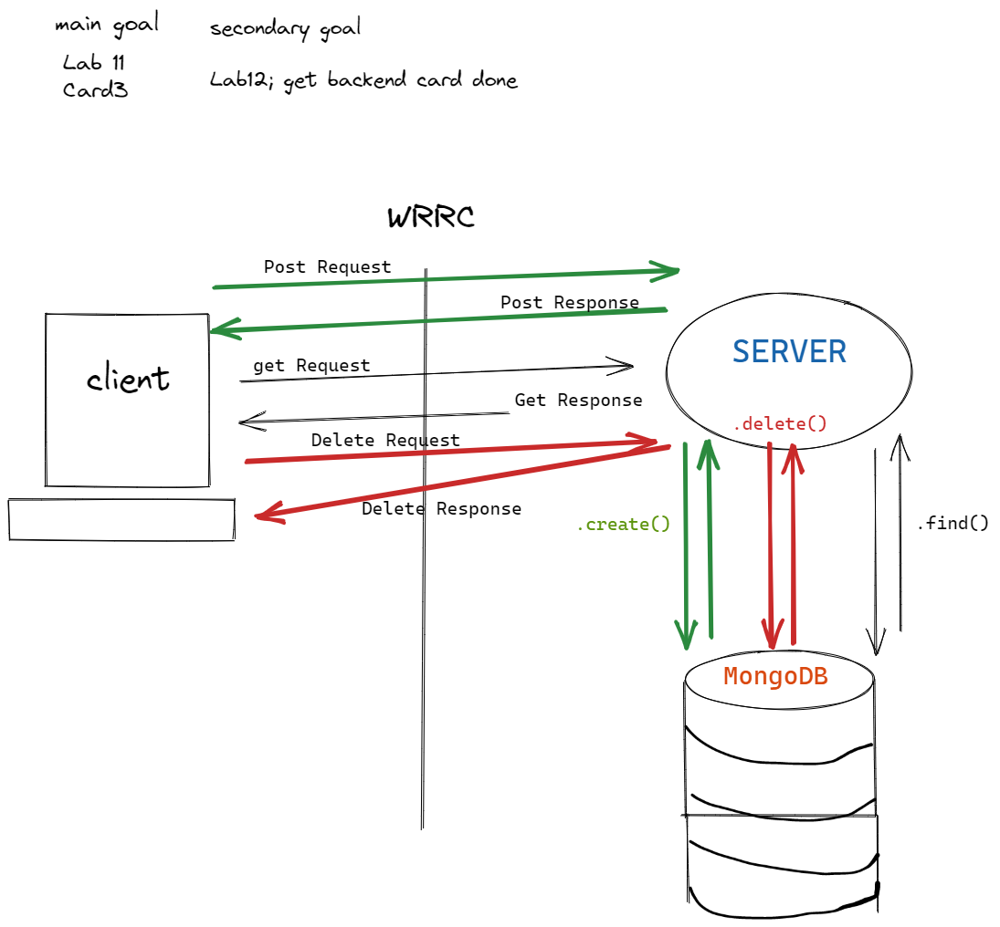

# Can Of Books

**Author**: Hambalieu Jallow, Kevin LaMarca
**Version**: 1.0.0 

## Overview
Creating an Online Bookstore Application  

## Getting Started
- Configured a new repository for our Front end Application
- Added an empty dotenv file   

## Card 2 
- - In the `BestBooks` component, make a `GET` request to your server `/books` route, in the `componentDidMount` function.  
- Store the book data returned from the server in the application `state`.  
- Use conditional logic to only render the books when there are more than 0 books stored in the application state.  
- When the server does return some books, use a Bootstrap carousel to render all the books returned.  
- When the server returns no books then render a message that the book collection is empty.  
- Use React Router to add ability for user to navigate between Profile and Home "pages".C  

## Card 3

- **Update**: On our app we give the user the ability to update book details on their list, so that they can change the book status, or update the book details as they  learn more about it.
- Add server code to handle `PUT` requests to a `/book/:id` route. Return the updated book.
- Add a form in the front end to let the user edit an existing book's details. When the form is submitted, send the new data to the server, and render the response. 

  

[TrelloBoard](https://trello.com/c/P4QfpppB/8-3-book-component-as-a-user-id-like-to-see-my-list-of-books-so-that-i-can-track-whats-impacted-me-and-whats-recommended-to-me)  

[TeamRule](https://docs.google.com/document/d/1RVJ2PoBzTdljn1Gm_S-nQU3y0B3QqDhNXiDn-QOIc2g/edit#heading=h.mx1b8tz44qrp)  

## 1/25/22 lab 12
Name of feature: Get data from Mongo via server and save data to local state

Estimate of time needed to complete: 20 mins

Start time: 7:15

Finish time: 7:30

Actual time needed to complete: 15 mins

Name of feature: Render header with conditional logout or profile component

Estimate of time needed to complete: 30 mins

Start time: 7:30

Finish time: 8:30

Actual time needed to complete: 60 mins  

## lab 13 Updates

Name of feature: Added Updates to our App

Estimate of time needed to complete: 2

Start time: 1:20

Finish time: 2:20
Actual time needed to complete: 1
